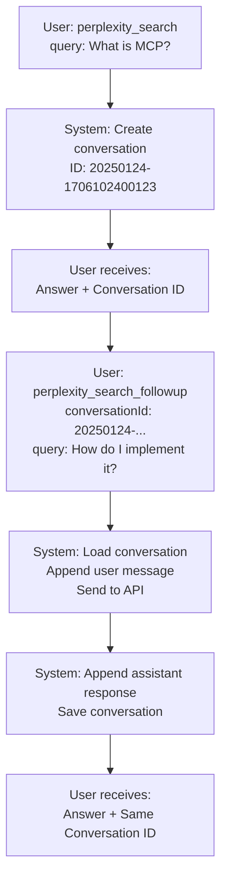
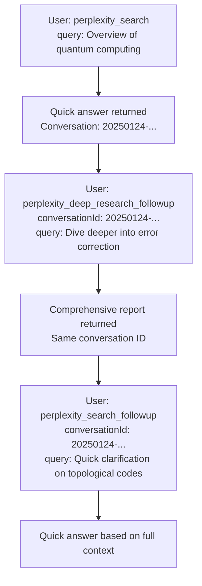

# Conversation Persistence Architecture

## Overview

This document outlines the architecture for adding conversation persistence to the Perplexity MCP Server, enabling multi-turn conversations with follow-up capabilities across both search and deep research modes.

## Problem Statement

Currently, each tool invocation is stateless. Users cannot:
- Follow up on previous queries without re-providing full context
- Switch between search and deep research modes while maintaining context
- Build upon previous research incrementally

## Solution Architecture

### Core Concepts

**Conversation Persistence**: Store conversation history to disk, enabling stateful multi-turn interactions.

**Mode Flexibility**: Users can switch between `perplexity_search` and `perplexity_deep_research` at any point in a conversation.

**Tool Separation**: Maintain existing tools unchanged, add new follow-up tools for clarity.

### Tool Suite

#### Existing Tools (Modified)
1. **perplexity_search** - Creates new conversation, returns conversation ID
2. **perplexity_deep_research** - Creates new conversation, returns conversation ID

#### New Tools
3. **perplexity_search_followup** - Continues conversation with search query
4. **perplexity_deep_research_followup** - Continues conversation with deep research query
5. **get_conversation_history** - Retrieves full conversation by ID

---

## File Structure

### Directory Layout

```
perplexity-mcp-server/
├── conversation-logs/              # Git-ignored, local persistence
│   ├── 20250124-1706102400123/     # [yyyymmdd]-[unix-ms]
│   │   └── conversation.json
│   ├── 20250124-1706102567890/
│   │   └── conversation.json
│   └── ...
```

### Conversation File Schema

**File**: `conversation-logs/[conversationId]/conversation.json`

```typescript
{
  "conversationId": "20250124-1706102400123",
  "createdAt": "2025-01-24T15:00:00.123Z",
  "updatedAt": "2025-01-24T15:05:30.456Z",
  "messageCount": 4,
  "messages": [
    {
      "role": "system",
      "content": "You are an advanced AI assistant..."
    },
    {
      "role": "user",
      "content": "What are the latest features in TypeScript 5.8?"
    },
    {
      "role": "assistant",
      "content": "TypeScript 5.8 introduces several key features..."
    },
    {
      "role": "user",
      "content": "How do I use the new decorators?"
    }
  ]
}
```

**Zod Schema**:
```typescript
const ConversationMessageSchema = z.object({
  role: z.enum(['system', 'user', 'assistant']),
  content: z.string(),
});

const ConversationSchema = z.object({
  conversationId: z.string(),
  createdAt: z.string().datetime(),
  updatedAt: z.string().datetime(),
  messageCount: z.number().int().nonnegative(),
  messages: z.array(ConversationMessageSchema),
});
```

---

## Conversation ID Format

**Pattern**: `[yyyymmdd]-[unix-milliseconds]`

**Examples**:
- `20250124-1706102400123`
- `20250125-1706188800456`

**Benefits**:
- Chronological sorting (date prefix)
- Uniqueness guaranteed (millisecond timestamp)
- Human-readable creation date
- No collision risk in typical usage

**Generator**:
```typescript
function generateConversationId(): string {
  const now = new Date();
  const dateStr = now.toISOString().slice(0, 10).replace(/-/g, ''); // yyyymmdd
  const timestampMs = now.getTime();
  return `${dateStr}-${timestampMs}`;
}
```

---

## Service Layer: Conversation Persistence

### New Service: `conversationPersistence.ts`

**Location**: `src/services/conversationPersistence.ts`

**Responsibilities**:
- Create new conversations
- Load existing conversations
- Append messages to conversations
- Validate conversation structure
- Handle file I/O errors gracefully

**Key Methods**:

```typescript
class ConversationPersistenceService {
  // Create new conversation with initial messages
  async createConversation(
    initialMessages: Message[],
    context: RequestContext
  ): Promise<Conversation>

  // Load conversation by ID
  async loadConversation(
    conversationId: string,
    context: RequestContext
  ): Promise<Conversation>

  // Append new message and return updated conversation
  async appendMessage(
    conversationId: string,
    message: Message,
    context: RequestContext
  ): Promise<Conversation>

  // Check if conversation exists
  async conversationExists(
    conversationId: string
  ): Promise<boolean>

  // Get conversation file path (for returning to user)
  getConversationPath(conversationId: string): string
}
```

**Error Handling**:
- `CONVERSATION_NOT_FOUND` - Invalid conversation ID
- `CONVERSATION_CORRUPTED` - JSON parse error
- `FILESYSTEM_ERROR` - I/O failures
- `VALIDATION_ERROR` - Schema validation failures

---

## Tool Implementations

### Tool: `perplexity_search` (Modified)

**Input**: Same as before (query, filters, etc.)

**Output**: Enhanced with conversation metadata
```typescript
{
  rawResultText: string;
  responseId: string;
  modelUsed: string;
  usage: { ... };
  searchResults?: [ ... ];
  // NEW FIELDS:
  conversationId: string;
  conversationPath: string;
}
```

**Response Header**:
```
🔗 **Conversation Started**
Conversation ID: `20250124-1706102400123`
Location: `/absolute/path/to/conversation-logs/20250124-1706102400123`

To follow up:
• Quick search: Use `perplexity_search_followup` with this conversation ID
• Deep dive: Use `perplexity_deep_research_followup` with this conversation ID
• View history: Use `get_conversation_history` with this conversation ID

---

[Search result content...]
```

**Logic Changes**:
1. Execute search as normal
2. Generate conversation ID
3. Create conversation with system prompt + user query + assistant response
4. Save to disk
5. Return enhanced response

---

### Tool: `perplexity_deep_research` (Modified)

**Changes**: Identical pattern to `perplexity_search` modification

---

### Tool: `perplexity_search_followup` (NEW)

**Input Schema**:
```typescript
const PerplexitySearchFollowupInputSchema = z.object({
  conversationId: z.string()
    .describe("The conversation ID from a previous search or deep research query."),
  query: z.string().min(1)
    .describe("Your follow-up question. This will be added to the conversation history."),
  return_related_questions: z.boolean().optional().default(false),
  search_recency_filter: z.string().optional(),
  search_domain_filter: z.array(z.string()).optional(),
  search_after_date_filter: z.string().optional(),
  search_before_date_filter: z.string().optional(),
  search_mode: z.enum(['web', 'academic']).optional(),
  showThinking: z.boolean().optional().default(false),
}).describe("Follow up on an existing conversation with a new search query...");
```

**Output**: Same as `perplexity_search` (includes conversation metadata)

**Logic Flow**:
1. Load conversation by ID
2. Append user's new query to conversation
3. Send full conversation history to Perplexity API
4. Append assistant response to conversation
5. Save updated conversation
6. Return result with same header format

---

### Tool: `perplexity_deep_research_followup` (NEW)

**Input Schema**: Same pattern as search followup, but with `reasoning_effort`

**Logic Flow**: Same as search followup, but uses deep research model

---

### Tool: `get_conversation_history` (NEW)

**Input Schema**:
```typescript
const GetConversationHistoryInputSchema = z.object({
  conversationId: z.string()
    .describe("The conversation ID to retrieve."),
  includeSystemPrompt: z.boolean().optional().default(false)
    .describe("Include the system prompt in the response."),
}).describe("Retrieve the full conversation history by ID...");
```

**Output Schema**:
```typescript
const GetConversationHistoryResponseSchema = z.object({
  conversationId: z.string(),
  createdAt: z.string().datetime(),
  updatedAt: z.string().datetime(),
  messageCount: z.number(),
  messages: z.array(ConversationMessageSchema),
  conversationPath: z.string(),
});
```

**Logic**:
1. Load conversation by ID
2. Optionally filter out system message
3. Return full conversation metadata

---

## Configuration Updates

### `src/config/index.ts`

Add new config variable:
```typescript
conversationLogsDir: z.string().default(
  path.join(PROJECT_ROOT, 'conversation-logs')
).describe("Directory for storing conversation logs"),
```

---

## Testing Strategy

### Unit Tests

**`tests/unit/services/conversationPersistence.test.ts`**:
- ✓ Create conversation successfully
- ✓ Load existing conversation
- ✓ Append message to conversation
- ✓ Handle missing conversation (error)
- ✓ Handle corrupted JSON (error)
- ✓ Validate conversation schema
- ✓ Generate unique conversation IDs

**`tests/unit/tools/perplexitySearchFollowup.test.ts`**:
- ✓ Follow up on existing conversation
- ✓ Apply search filters in follow-up
- ✓ Handle invalid conversation ID
- ✓ Validate conversation persistence after follow-up

**`tests/unit/tools/perplexityDeepResearchFollowup.test.ts`**:
- ✓ Follow up on existing conversation with deep research
- ✓ Handle reasoning_effort parameter
- ✓ Cross-mode follow-up (search → deep research)

**`tests/unit/tools/getConversationHistory.test.ts`**:
- ✓ Retrieve full conversation
- ✓ Filter system prompt when requested
- ✓ Handle non-existent conversation

**Integration Tests** (optional for future):
- ✓ Full workflow: create → follow up → retrieve
- ✓ Cross-mode workflows
- ✓ Concurrent access scenarios

### Test Fixtures

**`tests/fixtures/conversations.ts`**:
```typescript
export const mockConversation = {
  conversationId: "20250124-1706102400123",
  createdAt: "2025-01-24T15:00:00.123Z",
  updatedAt: "2025-01-24T15:00:00.123Z",
  messageCount: 3,
  messages: [
    { role: "system", content: "You are..." },
    { role: "user", content: "What is TypeScript?" },
    { role: "assistant", content: "TypeScript is..." },
  ],
};
```

---

## User Experience Flow

### Scenario 1: Simple Follow-up



### Scenario 2: Mode Switching



---

## Tool Descriptions (Critical for LLM Understanding)

### perplexity_search (Updated Description)

```
Performs a search-augmented query using Perplexity Search API. **IMPORTANT: This creates a NEW conversation.** You will receive a conversation ID that you can use for follow-ups.

**For first-time queries**: Use this tool with your complete, well-formed question.

**For follow-up queries**: Use `perplexity_search_followup` with the conversation ID from the previous response.

**Example First Query**:
{
  "query": "What are the security best practices for JWT authentication in Node.js Express applications as of 2025?"
}

Response includes:
- Answer to your query
- **conversationId**: e.g., "20250124-1706102400123"
- **conversationPath**: Absolute path to conversation file

**To follow up**:
- Quick answer: `perplexity_search_followup` + conversationId + new query
- Deep dive: `perplexity_deep_research_followup` + conversationId + new query
- View full history: `get_conversation_history` + conversationId
```

### perplexity_search_followup (New Tool Description)

```
Follow up on an existing Perplexity conversation with a new search query. This tool continues a conversation started by `perplexity_search` or `perplexity_deep_research`, maintaining full context.

**When to use**:
- You have a conversationId from a previous query
- You want to ask a follow-up question with quick search
- You're switching from deep research back to quick search

**Example**:
Previous query created conversation "20250124-1706102400123" about JWT authentication.

{
  "conversationId": "20250124-1706102400123",
  "query": "How do I implement refresh tokens with this approach?"
}

**Context Handling**:
The tool automatically includes the full conversation history, so you don't need to repeat previous context. Just ask your follow-up question naturally.

**Cross-Mode Support**:
You can follow up on a conversation started with `perplexity_deep_research` using this tool if you want a quick answer instead of another deep dive.

Response includes updated conversationId and path for further follow-ups.
```

### perplexity_deep_research_followup (New Tool Description)

```
Follow up on an existing Perplexity conversation with a deep research query. This tool continues a conversation started by `perplexity_search` or `perplexity_deep_research`, performing exhaustive research.

**When to use**:
- You have a conversationId from a previous query
- You want to dive deeper with comprehensive research
- You're switching from quick search to deep analysis

**Example**:
Previous quick search about JWT (conversation "20250124-1706102400123").

{
  "conversationId": "20250124-1706102400123",
  "query": "Perform comprehensive analysis of JWT security vulnerabilities and mitigation strategies",
  "reasoning_effort": "high"
}

**Context Handling**:
Full conversation history is automatically included. The deep research model will build upon all previous exchanges.

**Cross-Mode Support**:
You can follow up on a conversation started with `perplexity_search` using this tool to get a comprehensive deep dive on a subtopic.

Response includes comprehensive report + updated conversationId for further follow-ups.
```

### get_conversation_history (New Tool Description)

```
Retrieve the full conversation history by conversation ID. Useful for reviewing what's been discussed or debugging conversation context.

**When to use**:
- You want to see the complete conversation
- You need to verify what context is being maintained
- You're debugging follow-up behavior

**Example**:
{
  "conversationId": "20250124-1706102400123",
  "includeSystemPrompt": false
}

Returns full conversation with all messages, metadata, and file path.

**Note**: System prompts are excluded by default but can be included with `includeSystemPrompt: true`.
```

---

## Implementation Checklist

### Phase 1: Foundation
- [ ] Add `conversation-logs/` to `.gitignore`
- [ ] Add `CONVERSATION_LOGS_DIR` to config
- [ ] Create conversation ID generator utility
- [ ] Create conversation persistence service
- [ ] Write unit tests for persistence service

### Phase 2: Tool Modifications
- [ ] Update `perplexity_search` to create conversations
- [ ] Update `perplexity_deep_research` to create conversations
- [ ] Update response formatting with conversation headers
- [ ] Write tests for modified tools

### Phase 3: New Tools
- [ ] Implement `perplexity_search_followup`
- [ ] Implement `perplexity_deep_research_followup`
- [ ] Implement `get_conversation_history`
- [ ] Write comprehensive tests for all new tools

### Phase 4: Integration & Documentation
- [ ] Register all tools in server
- [ ] Create test fixtures for conversation workflows
- [ ] Write integration tests for cross-mode scenarios
- [ ] Update README with conversation examples
- [ ] Update memory bank
- [ ] Create migration guide for existing users

---

## Error Scenarios & Handling

| Error | Code | User Message | Recovery |
|-------|------|--------------|----------|
| Conversation not found | `CONVERSATION_NOT_FOUND` | "Conversation [ID] does not exist. Start a new conversation with `perplexity_search` or `perplexity_deep_research`." | User starts new conversation |
| Corrupted conversation file | `CONVERSATION_CORRUPTED` | "Conversation [ID] data is corrupted. Please start a new conversation." | User starts new conversation |
| File system error | `FILESYSTEM_ERROR` | "Unable to save conversation. [details]" | Retry or investigate permissions |
| Invalid conversation ID format | `VALIDATION_ERROR` | "Invalid conversation ID format. Expected: yyyymmdd-[timestamp]" | User provides valid ID |

---

## Future Enhancements (Out of Scope for v1)

- [ ] Conversation metadata search (find conversations by keywords)
- [ ] Conversation export (JSON, Markdown)
- [ ] Automatic conversation cleanup (age-based)
- [ ] Conversation branching (create alternate paths)
- [ ] Conversation merging
- [ ] Maximum message limits per conversation
- [ ] Conversation analytics (token usage, cost per conversation)
- [ ] Conversation sharing (export IDs for team collaboration)

---

## Security Considerations

**File System Access**:
- Conversations stored in project directory (not user-accessible externally)
- No path traversal vulnerabilities (validated conversation IDs)
- Proper file permissions (user read/write only)

**Data Privacy**:
- Conversations stored locally on server
- No external transmission of conversation data
- Users responsible for securing conversation-logs directory

**Input Validation**:
- Strict conversation ID format validation
- Message content sanitization
- Schema validation on all I/O operations

---

## Performance Considerations

**File I/O**:
- Single file per conversation (minimal overhead)
- No file locking (MCP typically single-threaded)
- Asynchronous read/write operations

**Conversation Size**:
- No artificial limits in v1
- Token limits enforced by Perplexity API
- Monitor for large conversations in production

**Scalability**:
- Flat directory structure sufficient for typical usage
- Future: Consider subdirectories if 10,000+ conversations

---

## Summary

This architecture provides:

✅ **Stateful Conversations**: Multi-turn interactions with full context  
✅ **Mode Flexibility**: Switch between search and deep research seamlessly  
✅ **Clear Separation**: New tools, existing tools enhanced but not breaking  
✅ **Simple Persistence**: File-based storage, no database required  
✅ **Developer-Friendly**: Clear IDs, accessible file paths, comprehensive errors  
✅ **Testable**: Clean service layer, mockable dependencies  
✅ **Extensible**: Foundation for future features (search, export, analytics)

**Next Step**: Review and approve plan, then switch to Code mode for implementation.